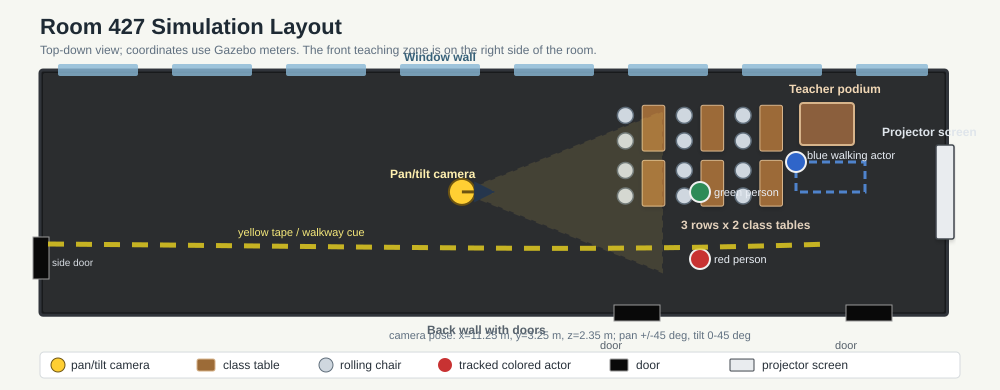
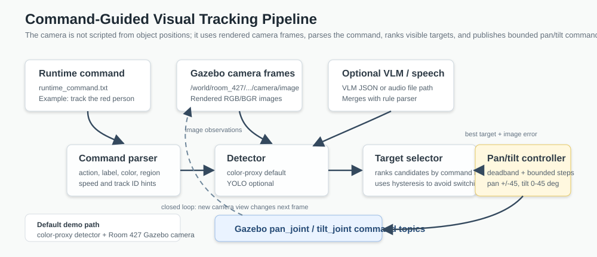

# IE582 Project: Command-Guided Camera Tracking and Mobile Camera Car

This project is a Gazebo simulation demo for interactive robot perception in a classroom and hallway environment. The main demo uses a pan/tilt camera mounted near the Room 427 ceiling. It subscribes to its own rendered camera images, detects visible colored people, parses a natural-language command, selects the best matching target, and sends bounded pan/tilt commands so the camera keeps the requested target in view.

The repository also includes a fourth-floor hallway world with a moving camera car. That extension shows the same camera/topic workflow on a mobile robot platform.

The final demo world is `Simulation/worlds/room_427.world`.



[YOUTUBE: Command-Guided Camera Tracking and Mobile Camera Car](https://youtu.be/TOwl1SmfSlQ)

## What This Demonstrates

The main goal is not just placing a camera in a world. The project demonstrates a complete command-to-action loop:

1. The user gives a command such as `track the red person`.
2. The system parses the command into a structured intent: action, label, color, region, track ID, and speed hint.
3. The Gazebo camera publishes real rendered image frames.
4. The detector finds staged colored people in those frames.
5. The target selector ranks visible candidates and stabilizes the selected track.
6. The pan/tilt controller turns image-space error into joint commands.
7. Gazebo updates the camera view, and the next frame closes the loop.



## Room 427 Demo Scene

`room_427.world` models the Room 427 class/demo environment:

- Classroom shell with black reflective floor, window wall, ceiling lights, and black doors.
- Opposite teaching wall with a projector screen and teacher podium.
- Front teaching section with 3 rows of 2 class tables and rolling chairs.
- Moving colored mesh actors used as trackable people.
- Ceiling-mounted pan/tilt camera at approximately `x=11.25`, `y=3.25`, `z=2.35`.
- The model supports pan from `-45` to `45` degrees and tilt from `0` to `90` degrees so the ceiling camera can look farther down at lower actors.

The older `Simulation/worlds/room_427_tracking_test.world` remains as a diagnostic world, but the final demo should use `room_427.world`.

## Repository Map

```text
Simulation/
  worlds/
    room_427.world                  # final Room 427 demo world
    fourth_floor.world              # hallway world with a moving camera car
  models/
    pantilt/                        # pan/tilt camera model
    ackermann_car/                  # mobile car with front camera and /cmd_vel control
    fourth_floor/                   # fourth-floor hallway environment
    class_table/                    # class table model
    rolling_chair/                  # rolling chair model
    podium/                         # teacher podium model
    projector_screen/               # projector screen model
    actor_colored/                  # colored moving human actors
scripts/
  run_gazebo_room_427_world.sh      # launch final Room 427 world
  run_gazebo_room_427_camera_view.sh
  run_gazebo_room_427_camera_tracker.sh
  run_gazebo_fourth_floor_world.sh
  run_gazebo_fourth_floor_global_view.sh
  run_gazebo_fourth_floor_camera_view.sh
  run_gazebo_fourth_floor_hallway_driver.sh
  pan_tilt_gazebo_tracker.py
  capture_gazebo_camera_frame.py    # optional README/report screenshot capture
src/ie582_final_project/
  command_parser.py                 # natural-language command parser
  target_selector.py                # scoring and target ranking
  pan_tilt_controller.py            # image error -> pan/tilt command
  pan_tilt_pipeline.py              # end-to-end tracking pipeline
  vision.py                         # color-proxy and YOLO conversion helpers
tests/
  test_command_parser.py
  test_target_selector.py
docs/images/
  room_427_layout.svg
  tracking_pipeline.svg
```

## Setup From A Fresh Clone

From a terminal, go to the repository root and create the local Python environment:

```bash
cd /path/to/IE582-Final_Project
python3 -m venv .venv
source .venv/bin/activate
python -m pip install --upgrade pip setuptools wheel
python -m pip install -e ".[vision]"
```

If `.venv` already exists, skip the `python3 -m venv .venv` line and just activate it. Activate the virtual environment in every new terminal before running project scripts:

```bash
cd /path/to/IE582-Final_Project
source .venv/bin/activate
```

Quick checks:

```bash
python -m unittest discover tests
gz sim --version
```

The default demo uses the lightweight `color-proxy` detector, so it does not require downloading a YOLO model. YOLO support is included as an optional path for future work. Do not commit `.venv`; it is a local environment folder created on each machine.

## Run The Room 427 Pan/Tilt Demo

Use three terminals at most. You do not need four terminals.

**Terminal 1: launch the final Room 427 world server**

```bash
cd /path/to/IE582-Final_Project
source ".venv/bin/activate"
./scripts/run_gazebo_room_427_world.sh
```

This terminal must stay running. It starts the Gazebo server, camera sensor, and render engine. Open the camera window only after this server is running.

On Apple Silicon, the script automatically prefers Metal. If you still see Ogre/render-engine errors, force Metal explicitly:

```bash
GZ_RENDER_BACKEND=metal ./scripts/run_gazebo_room_427_world.sh
```

**Terminal 2: optional camera POV window**

```bash
cd /path/to/IE582-Final_Project
source ".venv/bin/activate"
./scripts/run_gazebo_room_427_camera_view.sh
```

This attaches a Gazebo GUI panel to the pan/tilt camera topic:

```text
/world/room_427/model/pantilt/link/tilt_link/sensor/camera/image
```

**Terminal 3: run the tracker**

```bash
cd /path/to/IE582-Final_Project
source ".venv/bin/activate"
echo "track the red person" > runtime_command.txt
./scripts/run_gazebo_room_427_camera_tracker.sh
```

While the tracker is running, update `runtime_command.txt` from any terminal or by editing the file:

```bash
echo "track the blue person" > runtime_command.txt
echo "track the person on the left" > runtime_command.txt
echo "stop" > runtime_command.txt
```

Do not run two trackers at the same time. Multiple tracker processes will fight over the same pan/tilt command topics and make the camera look stuck or unstable.

## Run The Fourth Floor Camera Car Demo

The fourth-floor world is a separate mobile-robot demo. It uses:

```text
world:  Simulation/worlds/fourth_floor.world
model:  Simulation/models/ackermann_car
camera: /ackermann/front_camera/image
drive:  /cmd_vel
```

**Terminal 1: launch the fourth-floor world server**

```bash
cd /path/to/IE582-Final_Project
source .venv/bin/activate
./scripts/run_gazebo_fourth_floor_world.sh
```

Keep this terminal running. It starts the camera/rendering server. Use the same `GZ_IP` / `GZ_RELAY` settings in every terminal through the project scripts.

**Terminal 2: open the interactive global world view and car camera panel**

```bash
cd /path/to/IE582-Final_Project
source .venv/bin/activate
./scripts/run_gazebo_fourth_floor_global_view.sh
```

This view is for recording and manually gauging the car in the hallway. It uses only a 3D scene panel, so it does not open the stale Room 427 pan/tilt camera panel.
It also includes a small `/ackermann/front_camera/image` panel, so a separate camera GUI is not required.

**Terminal 3: autonomous hallway driver**

```bash
cd /path/to/IE582-Final_Project
source .venv/bin/activate
./scripts/run_gazebo_fourth_floor_hallway_driver.sh --base-speed 0.24
```

The driver subscribes to the car camera, follows the dark reflective floor corridor, and reverses/turns when the forward floor region shrinks near a wall or door. If the car turns toward the wall instead of away from it, restart the driver with:

```bash
./scripts/run_gazebo_fourth_floor_hallway_driver.sh --base-speed 0.24 --invert-steering
```

The car listens on `/cmd_vel`, so you can still publish manual commands if needed. Forward:

```bash
while true; do
  gz topic -t /cmd_vel -m gz.msgs.Twist \
    -p 'linear: {x: 0.35}, angular: {z: 0.0}'
  sleep 0.1
done
```

Press `Ctrl-C` to stop a manual loop, then publish a zero command:

```bash
gz topic -t /cmd_vel -m gz.msgs.Twist \
  -p 'linear: {x: 0.0}, angular: {z: 0.0}'
```

Check that the camera topic is live:

```bash
gz topic -l | grep camera
gz topic -f -t /ackermann/front_camera/image
```

You should see `/ackermann/front_camera/image` publishing at about 30 FPS.

Do not use `Simulation/gui/room_427_tracking_gui.config` for the fourth-floor recording. That file contains a Room 427 pan/tilt camera panel and can show a blank or stale camera widget.

## Commands The Camera Understands

The parser is intentionally small and deterministic so the demo works offline. The most reliable demo commands are:

```text
track the red person
track the green person
track the blue person
track the yellow person
track the person on the left
track the person on the right
track the person in the center
track id 3
track the blue person slowly
track the red person fast
stop
halt
freeze
cancel
```

The parser also recognizes classroom synonyms such as `student`, `teacher`, `professor`, and `instructor` as `person`. It recognizes object labels such as `chair`, `table`, `desk`, `bench`, `bottle`, `cone`, `box`, `backpack`, `ball`, `dog`, and `cat`, but the current default Gazebo demo detector is tuned for the colored people.

## How The Tracking Works

The tracker use camera images. The default visual detector thresholds the rendered camera image for red, green, blue, and yellow regions. Each color becomes one stable `person` detection:

```text
red -> track id 1
green -> track id 2
blue -> track id 3
yellow -> track id 4
```

The target selector then combines:

- command match: requested label, color, region, or track ID
- visual confidence
- target size
- distance from the image center
- sticky target bonus so the camera does not switch too easily

The pan/tilt controller uses image error:

- horizontal error controls `pan_joint`
- vertical error controls `tilt_joint`
- deadbands ignore tiny errors
- max step size prevents sudden jumps
- joint limits prevent physically invalid camera poses

## Expected Terminal Output

When it is working, the tracker prints target and scene summaries like:

```text
Subscribed to Gazebo topic: /world/room_427/model/pantilt/link/tilt_link/sensor/camera/image
Publishing pan/tilt commands for model: pantilt
Detector mode: color-proxy
target id=1 label=person score=1.206 cmd={'pan_joint': 3.0}
[scene] person id=1 conf=0.77 at center color=red; person id=3 conf=0.79 at left color=blue
```

If `cmd={}` appears, it usually means the target is already inside the deadband or the command would exceed the joint limit.

## Useful Checks

List camera topics:

```bash
gz topic -l | grep camera
```

Expected Room 427 camera topic:

```text
/world/room_427/model/pantilt/link/tilt_link/sensor/camera/image
```

Check that Gazebo is publishing frames:

```bash
gz topic -f -t /world/room_427/model/pantilt/link/tilt_link/sensor/camera/image
```

Run tests:

```bash
python3 -m unittest discover tests
```

Capture a camera image for documentation after the world is running:

```bash
python3 scripts/capture_gazebo_camera_frame.py \
  --output docs/images/live_camera_view.png
```

If Gazebo transport discovery is blocked on a machine, use the GUI camera window and take a normal screenshot instead.

## Troubleshooting

**`gz sim worlds/room_427.world` opens the wrong-looking world or cannot find models**

Run from `Simulation` or use the provided script. The important path is lowercase `models`:

```bash
cd /path/to/IE582-Final_Project/Simulation
export GZ_SIM_RESOURCE_PATH="$PWD/models"
gz sim worlds/room_427.world
```

The script does this setup automatically.

**Gazebo says `Render-engine must be loaded first` or crashes with `Failed to load render-engine`**

Start the world server first, then open the GUI camera view. Do not run `gz sim -g` or the tracker before the server is up:

```bash
./scripts/run_gazebo_room_427_world.sh
```

On Apple Silicon, prefer:

```bash
GZ_RENDER_BACKEND=metal ./scripts/run_gazebo_room_427_world.sh
```

If one command fails, close the old Gazebo process before retrying. Old server processes can keep topics alive and confuse the next run.

**Camera prints commands but nothing moves**

Check these first:

- Only one tracker process is running.
- The world is `room_427.world`, not the older tracking-test world.
- The tracker topic is `/world/room_427/model/pantilt/link/tilt_link/sensor/camera/image`.
- The requested color is visible in the camera view.
- The camera is not already at its pan/tilt limit.

**Camera spins or runs to the limit**

Stop the tracker, reset the world, then restart with one tracker only. Competing tracker terminals or stale Gazebo processes can publish conflicting commands.

## Evaluation Plan

A strong demo should show both behavior and evidence:

| Scenario | Command | Expected behavior |
| --- | --- | --- |
| Color selection | `track the red person` | Camera selects the red actor and centers it. |
| Target switch | `track the blue person` | Camera switches from the previous target to blue. |
| Region grounding | `track the person on the left` | Camera prefers a visible person on the left side of the frame. |
| Stop command | `stop` | Tracker stops publishing new motion commands. |
| Robustness | Restart world and tracker | Same commands work after a clean restart. |

Useful metrics:

- target selection accuracy
- time to reacquire after changing commands
- number of false switches
- command-to-camera response latency
- whether Gazebo produces non-finite joint warnings

## Design Choices

The final demo prioritizes reliability over unnecessary complexity:

- The default detector is deterministic and offline.
- The parser is rule-based, so command behavior is explainable.
- YOLO/VLM/speech support can be added without changing the core pipeline.
- The scene is detailed enough for a classroom demonstration but still lightweight enough to run on a laptop.

## Fourth Floor Design Note

`Simulation/worlds/fourth_floor.world` contains the larger hallway/car environment. The car demo is separate from the Room 427 pan/tilt tracker: Room 427 moves a fixed ceiling camera, while the fourth-floor demo moves the car itself and views the hallway through the car's front camera.

## Suggested Live Screenshots For Final Submission

Before exporting the final report or PDF, add these real screenshots if time allows:

- Gazebo overview of `room_427.world`.
- Pan/tilt camera POV window.
- Terminal output showing a successful `track the red person` run.
- Terminal output after switching to `track the blue person`.

Place them in `docs/images/` and reference them from this README or the final report. The included layout and pipeline figures already document the system structure; live screenshots add visual proof from a run on your machine.
